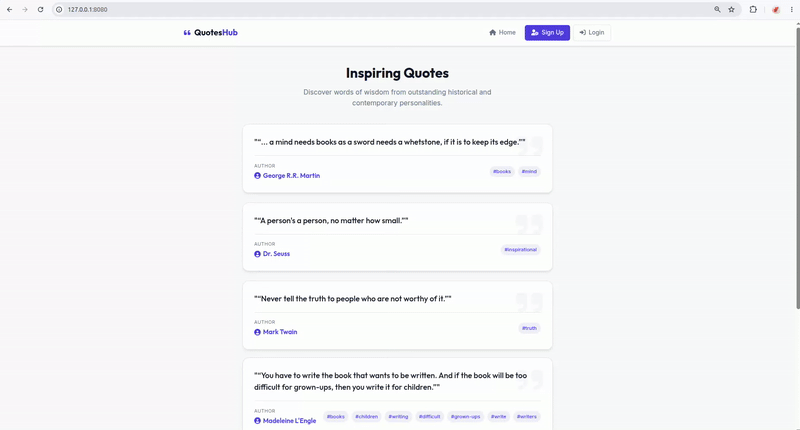

# Django Quotes Site

A modern, secure, and robust Django web application for sharing and managing quotes and authors. This project implements a comprehensive features stack including user authentication (signup, login, secure logout with CSRF protection), a dynamic navigation bar with global message banners, clean templates with DRY architecture inheritance, data import/export commands, structured logging for auditing, database performance indexing, and 100% test coverage for core business operations.

<p align="center">
  
</p>


---

## Table of Contents

1. [Project Overview](#project-overview)
2. [Core Features](#core-features)
3. [Prerequisites](#prerequisites)
4. [Installation & Setup](#installation--setup)
5. [Access & Usage](#access--usage)
6. [Configuration & Environment Variables](#configuration--environment-variables)
7. [Importing Sample Data](#importing-sample-data)
8. [Project Structure](#project-structure)

---

## Project Overview

The Django Quotes Site provides an intuitive dashboard for reading, sharing, and cataloging quotes. It isolates business logic into clear domains, utilizes Jakarta-style validation strategies on boundaries, and prevents vulnerabilities like CSRF logout attacks and plain-text password leakage by design.

---

## Core Features

- **User Authentication**: Secure sign up, login, and POST-only CSRF-protected logout.
- **Dynamic Navigation & Alert banners**: Standardized page layouts using `base.html` inheritance and global Django system notifications.
- **Quote & Author Catalogs**: Add new authors with biographies, select multiple tags using standard checklists, and query authors with indexed fields for optimization.
- **Structured Logging**: Automatic tracing of business lifecycle events (user signup, login, and resource additions) directed to console/file.
- **Robust Validation**: Strong verification of form fields and passwords.

---

## Prerequisites

- **Python**: version 3.12 or higher.
- **Poetry**: modern package manager for dependency resolution.

---

## Installation & Setup

Follow these steps to set up the project locally:

1. **Clone the repository**:
   ```bash
   git clone https://github.com/Bohdan-Nerushev/Implementing_a_Quotes_Website.git
   cd Implementing_a_Quotes_Website
   ```

2. **Navigate to the source directory**:
   ```bash
   cd src
   ```

3. **Install dependencies**:
   ```bash
   poetry install
   ```

4. **Set up Environment Variables**:
   Copy the example environment file and configure the parameters as needed:
   ```bash
   cp .env.example .env
   ```

5. **Run database migrations**:
   Create the SQLite database schema:
   ```bash
   poetry run python quotes_site/manage.py migrate
   ```

6. **Gather static assets**:
   Compile the CSS styling for the global application layout:
   ```bash
   poetry run python quotes_site/manage.py collectstatic --noinput
   ```

7. **Start the development server**:
   ```bash
   poetry run python quotes_site/manage.py runserver 8080
   ```

---

## Access & Usage

### Web Interface Access
Open your web browser and navigate to:
```
http://127.0.0.1:8080/
```

### Interface Routes
- **`/` (Main Page)**: Lists recent quotes with pagination (5 items per page) and tags.
- **`/login/`**: Allows existing users to authenticate.
- **`/signup/`**: Standard registration page (hashes passwords securely).
- **`/logout/`**: Secured URL requiring a POST request to prevent CSRF logout injection.
- **`/new-quote/`**: Form to submit new quotes with tags (requires login).
- **`/add-author/`**: Form to add new authors (requires login).
- **`/add-tag/`**: Form to register new tags in the system (requires login).
- **`/author/<id>/`**: Detail page displaying an author's birthplace, birthday, and biography.
- **`/profile/`**: User profile page summarizing credentials and action triggers (requires login).
- **`/profile/change-password/`**: Security form to update account credentials (requires login).
- **`/profile/change-email/`**: Form to update the user's email address with uniqueness validation (requires login).
- **`/profile/delete/`**: Secure account deletion form with password verification check (requires login).


---

## Configuration & Environment Variables

The application reads configuration from the environment (or the `.env` file):

| Variable | Description | Default |
|----------|-------------|---------|
| `DJANGO_SECRET_KEY` | Cryptographic signature key | django-insecure-key |
| `DJANGO_DEBUG` | Enable debug logs / tracebacks | `True` |
| `DJANGO_ALLOWED_HOSTS` | Permitted hostname string list | `localhost,127.0.0.1` |
| `DJANGO_EMAIL_HOST_PASSWORD` | Password credentials for smtp integrations | `your-password` |

---

## Importing Sample Data

If you need to import initial authors and quotes from JSON files, a dedicated script is provided:
```bash
poetry run python quotes_site/import_data.py
```
This utility uses transaction isolation (`transaction.atomic()`) to prevent partial or corrupt imports.

---

## Project Structure

```
Implementing_a_Quotes_Website/
├── README.md
├── src/
│   ├── pyproject.toml         # Poetry configuration
│   ├── .env.example           # Example env configuration
│   └── quotes_site/
│       ├── manage.py          # Django entrypoint
│       ├── quotes/            # Application logic (Models, Views, Forms)
│       ├── quotes_site/       # Core configurations (settings, urls)
│       ├── static/            # Static assets (styles.css)
│       └── templates/         # HTML templates extending base.html
└── scripts/                   # Auxiliary dev tooling
```
